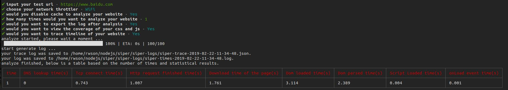

# siper

一个基于[puppeteer](https://github.com/GoogleChrome/puppeteer) 和 [PerformanceTiming API](https://developer.mozilla.org/en-US/docs/Web/API/PerformanceTiming)来评估网站性能的分析工具




#### 使用方法

```bash
npm install siper -g

siper
```

#### 性能指标


#### 各项指标对应中文介绍

|显示名称|中文含义|换算|
|---|----|----|
|DNS lookup time|DNS查询时间|`timing.domainLookupEnd - timing.domainLookupStart`|
|Tcp connect time|TCP完成握手时间|`timing.connectEnd - timing.connectStart`|
|Http request finished Time|HTTP请求响应完成时间|`timing.responseEnd - timing.requestStart`|
|Download time of the page|DOM开始加载前所花费时间|`timing.responseEnd - timing.navigationStart`|
|Dom loaded time|DOM加载完成时间|`timing.domComplete - timing.domLoading`|
|Dom parsed time|DOM结构解析完成时间|`timing.domInteractive - timing.domLoading`|
|Script Loaded time|脚本加载时间|`timing.domContentLoadedEventEnd - timing.domContentLoadedEventStart`|
|Onload event time|onload事件时间|`timing.domInteractive - timing.domLoading`|

#### 网络模式对应相关速率

|网络模式|是否离线|下载吞吐量(Byte)|上载吞吐量(Byte)|
|---|----|----|----|
|GPRS|否| `50 * 1024 / 8` | `20 * 1024 / 8` |
|Regular2G|否| `250 * 1024 / 8` | `250 * 1024 / 8` |
|Good2G|否| `450 * 1024 / 8` | `150 * 1024 / 8` |
|Regular3G|否| `750 * 1024 / 8` | `250 * 1024 / 8` |
|Good3G|否| `1.5 * 1024 * 1024 / 8` | `750 * 1024 / 8` |
|Regular4G|否| `4 * 1024 * 1024 / 8` | `3 * 1024 * 1024 / 8` |
|DSL|否| `2 * 1024 * 1024 / 8` | `1024 * 1024 / 8` |
|WiFi|否| `30 * 1024 * 1024 / 8` | `15 * 1024 * 1024 / 8` |


#### 亮点

- 支持禁用缓存模拟
- 支持弱网模拟
- 支持多次模拟
- 多次模拟
- 日志导出
